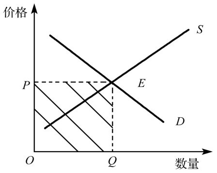

# 弹性及其应用

## 需求价格弹性

需求价格弹性指衡量某种 商品需求量相对变动 ,对于价格相对变动的敏感程度.

用公式表达

* 需求价格弹性= 需求变动的百分比 / 价格变动的百分比

用中点法计算

* 需求价格弹性 = (Q2-Q1)/[Q2+Q1]/2 / (P2-P1) /[P2+P1] /2
* 分子是中点计算的数量变动百分比,分母是中点计算的价格变动百分比

影响需求价格的弹性因素

1. 相近替代品的可获得性 (有相近替代品的有需求弹性,因为从这种物品转向其他物品较为容易)
2. 必需品和奢侈品
3. 市场的定义范围小的市场的需求弹性往往大于范围大的市场,因为范围小的市场上的物品更容易找到相近的替代品。
4. 物品的需求往往长期更富有弹性

## 需求收入弹性

定义:衡量某种商品需求量的相对变动对于消费者收入的相对变动反应的敏感程度。

用公式表示为:

* 需求收入弹性= 需求量变动百分比 / 收入变动百分比

需求收入弹性大于零的商品为正常品,正常品的需求量随着收入水平增加而增加；需求收入弹性小于零的商品为抵挡品,低档品的需求量随着收入水平增加而减少。

## 需求交叉价格弹性

* 需求的交叉价格弹性 = 物品 1 需求量变动的百分比 / 物品 2 价格变动百分比
* 需求交叉价格弹性是正数，则物品 1 和物品 2 是替代关系
* 需求交叉价格弹性是负数,则物品 1 和物品 2 是互补关系
* 需求交叉价格弹性等于零,则物品 1 和物品 2 没有关系

## 供给价格弹性

1. 供给价格弹性及其决定因素供给价格弹性往往取决于所考虑的时间长短

## 供给需求和弹性的三种应用

1. 农产品市场:技术进步使农产品供给曲线向右移动。但是,事务

# 反思

理解了许多供求弹性,之后,既可以用于分析单个商品也是用来分析整个市场经济行为。

1. 农产品市场:技术进步使农产品供给曲线向右移动。食物的需求通常缺乏弹性,因为食物并不昂贵,而且是必需品。供给向右上方移动引起均衡价格大幅度下降,以及均衡供给量较小量的增加。农业技术进步使得减少了支付给作为一个集团的农民的总收益。

2. 石油市场: 20 世纪 70 年代石油输出国组织为了提高价格而减少石油产量。在短期中,石油的需求是缺乏弹性的(陡峭),因为消费者不容易找到替代品。供给减少大大提高了价格,并增加了生产者的总收益,但是在长期中,消费者找到了替代品。供给减少大大提高了价格,并增加了生产者总收益。但是,在长期中,消费者找到了替代品,并使用更省油的汽车,这使得石油需求有弹性，而且生产者找到更多的石油,这使得供给曲线变得富有弹性。结果短期中石油价格大幅度上升。

3. 非法毒品市场:短期内非法毒品的需求是缺乏弹性的,减少毒品的禁毒政策往往使得毒品价格大幅度上升,而消费量减少的很少.因此吸毒者的总支付增加了,就需要增加吸毒者的支付资金,引起毒品相关的犯罪

## 弹性

弹性是指因变量的经济量的相对变化作为自变量的经济变量的相对变化的反应程度或灵敏程度,弹性用来表明两个经济变量变化的关系,当两个经济变量之间存在函数关系时,作为自变量的经济变量的变化,

* 需求价格弹性需求价格弹性指的某种商品需求量变动的百分比与价格百分比

* 弹性系数 E =因变量的变动比例 / 自变量的变动比例

* 需求价格弹性 =物品 1 需求量变动的百分比 / 物品 2 价格变动百分比

* 需求价格弹性 =需求变动的百分比 \* 价格变动的百分比

弹性概念在西方经济学中应用广泛:经济理论中有各种各样的弹性概念.弹性是两个量的相对变化的比。弹性是一个具体的数字,它与自变量因变量的度量单位无关.

### 需求价格弹性(elasi)

需求的价格弹性的经济含义可表示为"当价格变化百分之一时,需求量可能有百分之几的变化"。这一概念是由马歇尔在解释价格与需求的关系时提出的。需求价格弹性按照其大小可以分为五种。

* 若 E d= 0 称该物品的需求完全无弹性
* 若 0<E d<1 则称该物品的需求,为相当缺乏弹性,如多数生活必需品。
* 若 E d=1,则称该物品的需求为单位弹性，此时需求量的相对变化幅度与价格的相对变化幅度相等;
* 若 1< E d < ∞ ,则称该物品的需求相当富有弹性,这大多数是奢侈品的需求,
* 若 E d = ∞,则称为该物品的需求为完全有弹性.

## 什么是总收益?

总收益是指一定时期内厂商从一定量产品的销售中得到的货币总额

## 巩固和应用

1. 影响需求价格弹性因素有很多,其中主要有以下几个

* 相似替代品的可获得性 (有相似替代性的物品富有需求弹性)
* 必需品和奢侈品 (必需品缺乏弹性)
* 市场的定义 (市场范围小的弹性大)
* 时间范围 (物品在长期更有弹性)

TR= PQ

供给曲线 与需求曲线的交点 E 是均衡点

* 如果需求是富有弹性,价格上升会如何改变总收益?

如果需求是富有弹性的,降低价格会增加厂商的销售收入.相反提高价格会减少厂商的销售收入,即商品的价格与厂商的销售收入成反方向的变动.所以价格上升.

* 如果需求收入弹性小于 0,把这种商品成为什么?

抵挡商品.指的是

* 一场暴风摧毁了豆作物的一半,当需求非常富有弹性还是非常缺乏弹性时候,这个事件对农民伤害更大?

当需求更富有弹性时候,该事件对农民伤害更大。因为暴风对豆作物的摧毁使得豆作物的供给曲线向左移动。
